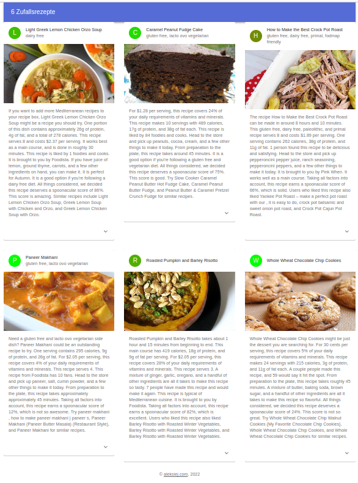

# Rezepturen

Dies ist ein Programm zur Demonstration mehrerer interessanter Technologien.
* Das Frontend ist in React, Javascript, CSS und HTML mit Material-UI framework geschrieben.
* Das Frontend hat auf den GitHub-Seiten gehostet. 
* Das Backend ist in Golang geschrieben.
* Die DateBase ist Mongo DB als Serverless.
* Der Datenanbieter ist https://spoonacular.com/

- Der Zweck dieses Programms besteht darin, 6 zufällige Kochrezepte anzuzeigen.
- Die Farbe des Icons ändert sich von grün nach rot. Grün ist gesundes Essen. Rot ist kein sehr gesundes Essen.

**DEMO** https://aleksiej.com/rezepturen/

